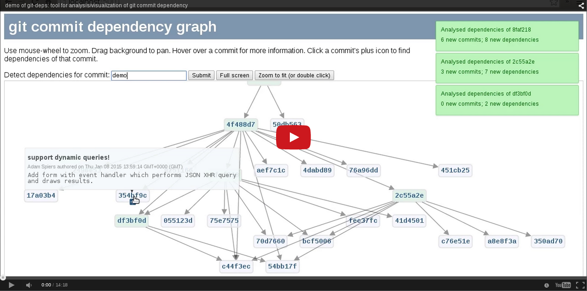

git-deps
========

`git-deps` is a tool for performing automatic analysis of dependencies
between commits in a [git](http://git-scm.com/) repository.  Here's
a screencast demonstration:

I also spoke about the tool in
[episode #32 of the GitMinutes podcast](http://episodes.gitminutes.com/2015/03/gitminutes-32-adam-spiers-on-git-deps.html).

Background theory
-----------------

It is fairly clear that two git commits within a single repo can be
considered "independent" from each other in a certain sense, if they
do not change the same files, or if they do not change overlapping
parts of the same file(s).

In contrast, when a commit changes a line, it is "dependent" on not
only the commit which last changed that line, but also any commits
which were responsible for providing the surrounding lines of context,
because without those previous versions of the line and its context,
the commit's diff might not cleanly apply (depending on how it's being
applied, of course).  So all dependencies of a commit can be
programmatically inferred by running git-blame on the lines the commit
changes, plus however many lines of context make sense for the use
case of this particular dependency analysis.

Therefore the dependency calculation is impacted by a "fuzz" factor
parameter
(c.f. [patch(1)](http://en.wikipedia.org/wiki/Patch_(Unix))), i.e. the
number of lines of context which are considered necessary for the
commit's diff to cleanly apply.

As with many dependency relationships, these dependencies form edges
in a DAG (directed acyclic graph) whose nodes correspond to commits.
Note that a node can only depend on a subset of its ancestors.

Motivation
----------

Sometimes it is useful to understand the nature of parts of this DAG,
as its nature will impact the success or failure of operations
including merge, rebase, cherry-pick etc.

### Use case 1: porting between branches

For example when porting a commit "A" between git branches via `git
cherry-pick`, it can be useful to programmatically determine in advance
the minimum number of other dependent commits which would also need to
be cherry-picked to provide the context for commit "A" to cleanly
apply.  Here's a quick demo!

### Use case 2: splitting a patch series

Large patch series or pull requests can be quite daunting for project
maintainers, since they are hard to conquer in one sitting.  For this
reason it's generally best to keep the number of commits in any
submission reasonably small.  However during normal hacking, you might
accumulate a large number of patches before you start to contemplate
submitting any of them upstream.  In this case, `git-deps` can help
you determine how to break them up into smaller chunks.  Simply run

    git deps -e $upstream_branch -s

and then create a graph starting from the head of your local
development branch, recursively expanding all the dependencies.  This
will allow you to untangle things and expose subgraphs which can be
cleanly split off into separate patch series or pull requests for
submission.

### Use case 3: aiding collaborative communication

Another use case might be to better understand levels of specialism /
cross-functionality within an agile team.  If I author a commit which
modifies (say) lines 34-37 and 102-109 of a file, the authors of the
dependent commits forms a list which indicates the group of people I
should potentially consider asking to review my commit, since I'm
effectively changing "their" code.  Monitoring those relationships
over time might shed some light on how agile teams should best
coordinate efforts on shared code bases.

### Caveat

Note the dependency graph is likely to be semantically incomplete; for
example it would not auto-detect dependencies between a commit A which
changes code and another commit B which changes documentation or tests
to reflect the code changes in commit A.  (Although of course it's
usually best practice to logically group such changes together in a
single commit.)  But this should not stop it from being useful.

### Other uses

I'm sure there are other use cases I haven't yet thought of.  If you
have any good ideas, [please submit them](CONTRIBUTING.md)!

### Non-use cases

At first I thought that `git-deps` might provide a useful way to
programmatically predict whether operations such as merge / rebase /
cherry-pick would succeed, but actually it's probably cheaper and more
reliable simply to perform the operation and then roll back.

Installation
------------

Please see [the `INSTALL.md` file](INSTALL.md).

Usage
-----

The tool is not yet fully documented, but usage is fairly
self-explanatory if you run `git deps -h`.

Currently you should run it from the root (i.e. top directory) of the
git repository you want to examine; this is a
[known limitation](https://github.com/aspiers/git-deps/issues/27).

By default it will output all dependencies of the given commit-ish(s),
one per line.  With `--recurse`, it will traverse dependencies of
dependencies, and so on until it cannot find any more.  In recursion
mode, two SHA1s are output per line, indicating that the first depends
on the second.

### Web UI for visualizing and navigating the dependency graph

If you run with the `--serve` option then it will start a lightweight
webserver and output a URL you can connect to for dynamically
visualizing and navigating the dependency graph.  

Optionally choose a commit-ish (the form defaults to `master`), click
the `Submit` button, and you should see a graph appear with one node
per commit.  By hovering the mouse over a node you will see more
details, and a little `+` icon will appear which can be clicked to
calculate dependencies of that commit, further growing the dependency
tree.  You can zoom in and
out with the mousewheel, and drag the background to pan around.  

If you set up a MIME handler for the `gitfile://` protocol during
setup, [as documented](INSTALL.md) you will be able to double-click on
nodes to launch a viewer to inspect individual commits in more detail.

Development / support / feedback
--------------------------------

Please see [the CONTRIBUTING file](CONTRIBUTING.md).

History
-------

This tool was born from experiences at
[SUSEcon](http://www.susecon.com/) 2013, when I attempted to help a
colleague backport a bugfix in [OpenStack](http://www.openstack.org/)
[Nova](http://docs.openstack.org/developer/nova/) from the `master`
branch to a stable release branch.  At first sight it looked like it
would only require a trivial `git cherry-pick`, but that immediately
revealed conflicts due to related code having changed in `master`
since the release was made.  I manually found the underlying commit
which the bugfix required by using `git blame`, and tried another
`cherry-pick`.  The same thing happened again.  Very soon I found
myself in a quagmire of dependencies between commits, with no idea
whether the end was in sight.

In coffee breaks during the ensuing openSUSE conference at the same
venue, I feverishly hacked together a prototype and it seemed to work.
Then normal life intervened, and no progress was made for another
year.

Thanks to SUSE's generous [Hack Week](https://hackweek.suse.com/)
policy, I had the luxury of being able to spending some of early
January 2015 working to bring this tool to the next level.  I
submitted a
[Hack Week project page](https://hackweek.suse.com/11/projects/366)
and
[announced my intentions on the `git` mailing list](http://article.gmane.org/gmane.comp.version-control.git/262000).

Again in May 2018 I took advantage of another Hack Week to package
`git-deps` properly as a Python module in order to improve the
installation process.  This was in preparation for demonstrating the
software at [a Meetup
event](https://www.meetup.com/londongit/events/248694943/) of the [Git
London User Group](https://www.meetup.com/londongit/).

License
-------

Released under [GPL version 2](COPYING) in order to be consistent with
[`git`'s license](https://github.com/git/git/blob/master/COPYING), but
I'm open to the idea of dual-licensing if there's a convincing reason.
